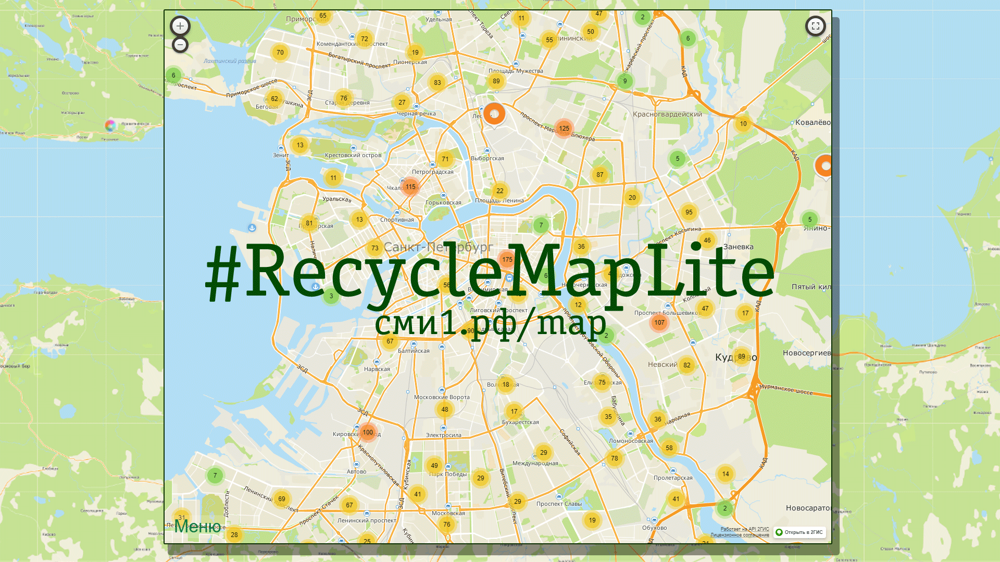

# RecycleMapLite




### Description

Fast and minimalistic frontend for Greenpeace's [Recyclemap.ru](https://recyclemap.ru)

Markers geolocation data and images in the ```/img``` directory are taken from Greenpeace's [Recyclemap.ru](https://recyclemap.ru) itself. Some 3rd-party libraries placed in the ```/lib``` directory.

Live website can be found here: [сми1.рф/map](https://xn--1-otblt.xn--p1ai/map/)

### Additionally

* [The Presentation](https://docs.google.com/presentation/d/e/2PACX-1vRnD9s5GydrFtgmtxEaPdgv2TDHD97JdC8d2C8FN6NiVbSwQbl1GBzjInzxCUPn9xaQrE9CvRycyNhv/pub?start=false&loop=false&delayms=3000&slide=id.gcb9a0b074_1_0)

* [The Conference Paper](https://scm.etu.ru/assets/files/2020/scm20/papers/5/306.pdf) (SCM'2021) / [[ENG](https://ieeexplore.ieee.org/document/9507188)] [[E-Library](https://elibrary.ru/item.asp?id=46360944)]
* Author's: [ORCID: 0000-0002-7501-3119](https://orcid.org/0000-0002-7501-3119)


